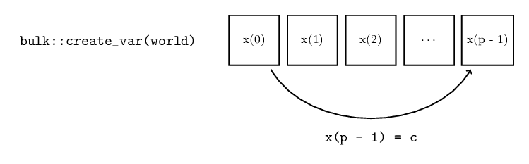

Variables
=========

Now that we are able to set up the environment, and gained some familiarity with the *world* object that can be used to communicate with other processors, we are ready to discuss communication between processors. The most fundamental way of communicating between processors is using *distributed variables*. The variables can be created as follows:

.. code-block:: cpp

    auto x = bulk::create_var<int>(world);

Here we create a distributed variable that holds an integer. A distributed variable exists on every processor, but can have different values on different processors. These different local 'copies' are referred to as *images* of the variable. The variable lives within the *world* of the current SPMD section, and we explicitely write this by passing the world object as a parameter to the variable creation function.

.. note::
    As a technical note, we mention that the :code:`create_var` and related functions, are available purely as convenience methods. The type of the variable depends on the backend, and can be very complicated. The create function helps the user to prevent writing:

    .. code-block:: cpp

        typename decltype(world)::var_type<int> x(world);

    Instead, it deduces the correct type itself.

While :code:`x` refers to the *local image* of a variable, it is identified with images on remote processors by the order in which variables are constructed (which is possible because of the SPMD nature of Bulk programs). This allows us to *write to* and *read from* remote images of a variable by simply passing :code:`x` to communication functions.

Bulk-synchronous communication
------------------------------

The main way to manipulate remote images of variables is using the communication primitives :code:`bulk::put` and :code:`bulk::get` for writing and reading respectively. For example, to write the value :code:`1` to the remote image held by the next logical processor, we write:

.. code-block:: cpp

    bulk::put(world.next_processor(), x, 1);

To obtain the value of a remote image we write:

.. code-block:: cpp

    auto y = bulk::get(world.next_processor(), x);

.. tip::
    Equivalently, we can use the short-hand notations:

    .. code-block:: cpp

        x(world.next_processor()) = 1;
        auto y = x(world.next_processor());

This communication is *asynchronous*, meaning that the values are not valid immediately after the execution of the communication primitives. Instead, they are available in the next 'section' of the program, known as a (BSP) **superstep**. Supersteps can be viewed as the section of the program within successive calls to :code:`world.sync()`. This barrier synchronization asserts that all processors have reached that point of the program, and resolves all outstanding communication such as those staged by calls to put and get. After the barrier synchronization returns, all communication staged in the previous superstep is guarenteed to have occured.

.. figure:: images/superstep.png
    :align: center

    The structure of a superstep. First, computations are performed. Optionally, communication is staged for later execution. After each core finishes their computations, outstanding communications are performed. This process is repeated until the SPMD section terminates.

In case of *put*, the remote image now contains the value written to it (assuming that the local processor is the only one who wrote to that specific remote image). For read requests using *get*, it is slightly more complicated. The type of :code:`y` is a :code:`bulk::future<T>`. A future object is a placeholder, that will contain the correct value in the next superstep. This value can be obtained after the synchronization using:

.. code-block:: cpp

    auto value = y.value();

This way of communicating is particularly useful when dealing with simple data objects. If instead we deal with distributed array-like objects, we recommend using *co-arrays*, which are introduced in the next section.
